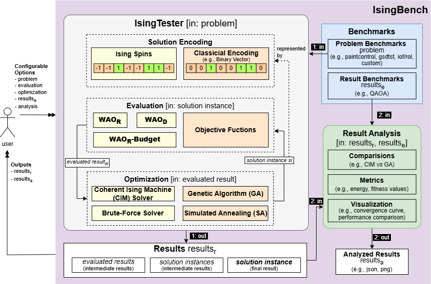
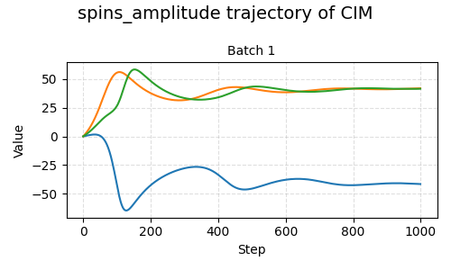
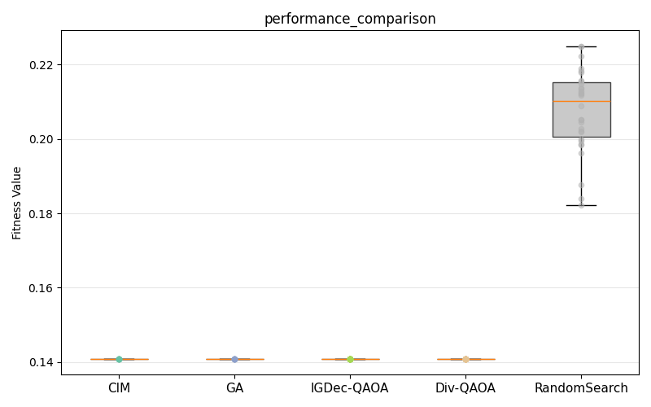

# IsingBench

Ising Bench is an open-source, Python-based command-line tool that provides a unified, end-to-end pipeline for solving test optimization problems through the Ising model computational paradigm.


---

## Demonstration

A demonstration of IsingBench is available in two ways:
- **Local**: See [`demonstration.mp4`](demonstration.mp4) in this repository.
- **Online**: Access the demo at [https://www.modelcopilot.org/QSE](https://www.modelcopilot.org/QSE).

## Overview

IsingBench addresses two classic NP-hard software testing challenges:

- **Test Case Selection (TCS)** — identify a subset of test cases that retains strong fault-detection capability while satisfying constraints such as execution time and testing budget.
- **Test Case Minimization (TCM)** — reduce the overall test suite size while preserving satisfactory fault coverage or other effectiveness properties.

Both problems are reformulated as **Ising spin configurations** and solved by minimizing an Ising Hamiltonian:

$$E(\mathbf{s}) = -\sum_i h_i s_i - \frac{1}{2} \sum_{i,j} J_{ij} s_i s_j$$

where $s_i \in \{-1, +1\}$ are spin variables, $h_i$ are linear coefficients, and $J_{ij}$ are quadratic coefficients.


The framework structure of IsingBench is as follow, composed of Benchmarks, IsingTester, and Result Analysis.



### Workflow

The workflow starts with the user configuring a problem, evaluation strategy, solver, and
analysis settings. The problem can be loaded from the built-in benchmark library or provided
as a custom dataset.

IsingTester then encodes the problem into candidate solutions — either as Ising spin
configurations evaluated via an Ising Hamiltonian, or as binary vectors evaluated via
classical objective functions. A user-selected solver iteratively improves these candidates
until a final solution is returned.

Results are passed to the Result Analysis module, which computes metrics such as energy
and fitness values and generates visualizations including convergence curves and performance
comparison plots. When the same benchmark is used with consistent configurations, results can also be compared directly
against reference methods from the literature such as QAOA.

---

## Installation

```bash
git clone https://github.com/WSE-Lab/IsingBench.git
cd IsingBench
pip install -r requirement.txt
```

**Requirements:** Python 3.11+, PyTorch (CUDA optional)

```bash
# PyTorch with CUDA 12.6 (recommended)
pip install torch torchvision torchaudio --index-url https://download.pytorch.org/whl/cu126
```

---

## Quick Start

### Query available resources

```bash
# List all supported problems (encoding strategies)
ising_bench query problems

# List all supported solvers
ising_bench query solvers

# List all benchmarks in the library
ising_bench query benchmarks

# Inspect a specific benchmark
ising_bench query benchmark-config --name paintcontrol
```

### Run via YAML configuration

```yaml
# config.yaml
problem:
  name: WAOr
  params:
    effectiveness: 
    - rate
    cost: 
    - time
benchmark:
  library:
    name: paintcontrol
solvers:
  - name: CIM
results:
  save_path: ./results
```
```bash
ising_bench test --yaml config.yaml
```

### Run via CLI flags

```bash
python ising_bench.py \
  --problem WAOr \
  --library paintcontrol \
  --problem-param \
    effectiveness=['rate'] \
    cost=['time'] \
    minimization=true \
  --solver CIM \
  --solver GA \
  --save-path ./results \
  --convergence-curve spins_amplitude fitness_value
```

> For a complete reference of all configuration options, see [docs/configuration.md](docs/configuration.md).

>Ready-to-run example configs and their results are available in [examples/](examples/).
---

## Benchmarks

| Benchmark | Test Cases | Attributes |
|-----------|-----------|------------|
| `paintcontrol` | 90 | `time`, `rate` |
| `gsdtsr` | 5555 | `time`, `rate` |
| `iof/rol` | 1941 | `time`, `rate` | 

To inspect available metrics and baseline results for a benchmark:
```bash
ising_bench query benchmark-config --name [NAME]
```
## Optimization Strategies

| Strategy | Description |
|----------|-------------|
| `WAOr` | Weighted Attribute Optimization (Ratio-Based) |
| `WAOd` | Weighted Attribute Optimization (Deviation-Based) |
| `WAOr-Budget` | WAOr with a user-defined budget constraint |

> For mathematical formulations and implementation details, see [docs/strategies.md](docs/problems.md)
---

## Solvers

| Solver | Type | Description |
|--------|------|-------------|
| CIM | Ising | Coherent Ising Machine simulation (GAPP model) |
| BruteForce | Ising | Exhaustive search, use to verify optimality |
| GA | Classical | Genetic Algorithm |
| SA | Classical | Simulated Annealing |

> For solver-specific parameters, see [docs/solvers.md](docs/solvers.md).

## Result Analysis

IsingBench can generate the following plots and save them to `<save_path>/figs/`.

### Convergence Curves

Convergence curves show how the optimization evolves over iterations. The available keys
depend on the solver type — not all keys are supported by every solver:

| Key | Description |
|-----|-------------|
| `fitness_value` | Fitness value of the solution per iteration |
| `energy` | Ising energy of the spin configuration per iteration |
| `spins_amplitude` | Amplitude of spin variables over iterations |

Unsupported keys for a given solver are silently skipped.



### Performance Comparison

When `--performance-comparison` is enabled, IsingBench generates a box plot summarizing
fitness scores across all runs for each solver, together with any loaded baseline results.
This enables direct visual comparison between solvers and reference methods from the literature.



## Extending IsingBench

### Adding a Custom Problem

Subclass `BaseProblem`, implement the required methods, and register with `@register_problem`:

```python
from ising_bench import BaseProblem, register_problem

@register_problem("MyProblem")
class MyProblem(BaseProblem):
    def __init__(self, csv_path: str, **kwargs):
        super().__init__(csv_path)

    def _calc_ising(self):
        # Translate input data into (J, h) numpy arrays
        ...

    def fitness_function(self, solution):
        # Evaluate objective value for a decoded solution
        ...

    def classical_info(self):
        # Return (num_of_bits, direction, constraint_fn)
        ...

    def spins2solution(self, spins):
        # Convert spin configuration to problem-domain solution
        ...

    def get_selected_test_case(self, solution):
        ...
```

### Adding a Custom Solver

Subclass `BaseIsingSolver` (operates on J and h) or `BaseClassicalSolver` (operates in binary solution space), then register with `@register_solver`:

```python
from ising_bench.solvers import BaseIsingSolver, register_solver, Result

@register_solver("MySolver")
class MySolver(BaseIsingSolver):
    def __init__(self, J, h, steps: int = 1000, device="cpu"):
        super().__init__(J, h, device)
        self.steps = steps

    def _run(self, num_runs: int) -> Result:
        # Core solver logic — called inside torch.no_grad()
        ...
```

The base class automatically handles seeding, batching, timing, and result merging.

---

## License

See [LICENSE](LICENSE) for details.
